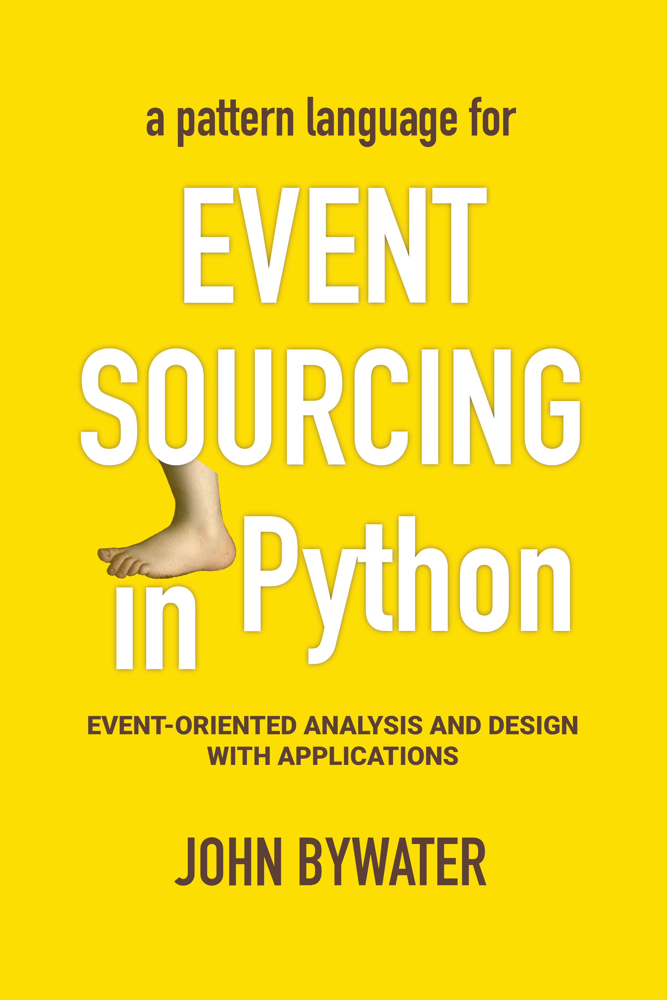
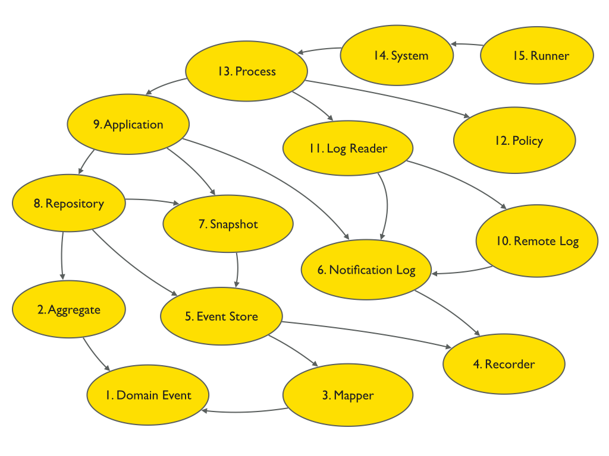

============
Introduction
============

This is a library for event sourcing in Python. This section introduces the
library, and presents a synopsis of the code. This section also provides
a conceptual overview of event sourcing and enterprise application architecture.

.. _event-sourcing-in-15-minutes:

Event sourcing in 15 minutes
============================

The "live coding" video below shows how to do event sourcing with Python in less than 15 minutes.

.. raw:: html

    

      <iframe style="width:100%;height:100%;position:absolute;left:0px;top:0px;"
        src="https://www.youtube.com/embed/V1iKSn7Fark" title="YouTube video player"
        frameborder="0"
        allow="accelerometer; autoplay; clipboard-write; encrypted-media; gyroscope; picture-in-picture"
        allowfullscreen>
      </iframe>
    

     
     

.. _Synopsis:

Synopsis
========

Use the library's :class:`~eventsourcing.domain.Aggregate` class and the :func:`@event<eventsourcing.domain.event>` decorator to define
event-sourced aggregates.

.. code-block:: python

    from eventsourcing.domain import Aggregate, event

    class Dog(Aggregate):
        @event('Registered')
        def __init__(self, name):
            self.name = name
            self.tricks = []

        @event('TrickAdded')
        def add_trick(self, trick):
            self.tricks.append(trick)

Aggregate events will be triggered when decorated
methods are called, and the decorated method bodies will be used to mutate
the state of the aggregate.

Use the library's :class:`~eventsourcing.application.Application` class to define event-sourced applications.
Add command and query methods that use event-sourced aggregates.

.. code-block:: python

    from eventsourcing.application import Application

    class DogSchool(Application):
        def register_dog(self, name):
            dog = Dog(name)
            self.save(dog)
            return dog.id

        def add_trick(self, dog_id, trick):
            dog = self.repository.get(dog_id)
            dog.add_trick(trick)
            self.save(dog)

        def get_dog(self, dog_id):
            dog = self.repository.get(dog_id)
            return {'name': dog.name, 'tricks': tuple(dog.tricks)}

An application combines domain model aggregates persistence infrastructure.
Aggregate events are collected and stored by the appliation :func:`~eventsourcing.application.Application.save`
method. Aggregate events are retrieved and used to reconstruct aggregates
by the repository :func:`~eventsourcing.application.Repository.get` method.

Construct an application object by calling the application class.

.. code-block:: python

    application = DogSchool()

Evolve the state of the application by calling the application's command methods.

.. code-block:: python

    # Register a new dog.
    dog_id = application.register_dog(name='Fido')

    # Add tricks.
    application.add_trick(dog_id, trick='roll over')
    application.add_trick(dog_id, trick='fetch ball')

Access the state of the application by calling the application's query methods.

.. code-block:: python

    # Get dog details.
    dog_details = application.get_dog(dog_id)

    assert dog_details['name'] == 'Fido'
    assert dog_details['tricks'] == ('roll over', 'fetch ball')

Select event notifications from the application's notification log.

.. code-block:: python

    # Select event notifications.
    notifications = application.notification_log.select(start=1, limit=10)

    assert len(notifications) == 3
    assert notifications[0].id == 1
    assert notifications[1].id == 2
    assert notifications[2].id == 3

Please read the :doc:`Tutorial </topics/tutorial>` for more information.

Features
========

**Flexible event store** — flexible persistence of domain events. Combines
an event mapper and an event recorder in ways that can be easily extended.
Mapper uses a transcoder that can be easily extended to support custom
model object types. Recorders supporting different databases can be easily
substituted and configured with environment variables.

**Domain models and applications** — base classes for domain model aggregates
and applications. Suggests how to structure an event-sourced application.

**Application-level encryption and compression** — encrypts and decrypts events inside the
application. This means data will be encrypted in transit across a network ("on the wire")
and at disk level including backups ("at rest"), which is a legal requirement in some
jurisdictions when dealing with personally identifiable information (PII) for example
the EU's GDPR. Compression reduces the size of stored domain events and snapshots, usually
by around 25% to 50% of the original size. Compression reduces the size of data
in the database and decreases transit time across a network.

**Snapshotting** — reduces access-time for aggregates with many domain events.

**Versioning** - allows domain model changes to be introduced after an application
has been deployed. Both domain events and aggregate classes can be versioned.
The recorded state of an older version can be upcast to be compatible with a new
version. Stored events and snapshots are upcast from older versions
to new versions before the event or aggregate object is reconstructed.

**Optimistic concurrency control** — ensures a distributed or horizontally scaled
application doesn't become inconsistent due to concurrent method execution. Leverages
optimistic concurrency controls in adapted database management systems.

**Notifications and projections** — reliable propagation of application
events with pull-based notifications allows the application state to be
projected accurately into replicas, indexes, view models, and other applications.
Supports materialized views and CQRS.

**Event-driven systems** — reliable event processing. Event-driven systems
can be defined independently of particular persistence infrastructure and mode of
running.

**Detailed documentation** — documentation provides general overview, introduction
of concepts, explanation of usage, and detailed descriptions of library classes.
All code is annotated with type hints.

**Worked examples** — includes examples showing how to develop aggregates, applications
and systems.

..
    **Hash chaining** — Sequences of events can be hash-chained, and the entire sequence
    of events checked for data integrity. Information lost in transit or on the disk from
    database corruption can be detected. If the last hash can be independently validated,
    then so can the entire sequence.

..
    **Correlation and causation IDs** - Domain events can easily be given correlation and
    causation IDs, which allows a story to be traced through a system of applications.

Design overview
===============

The design of the library follows the notion of a "layered" or "onion" or "hexagonal"
architecture in that there are :doc:`separate modules  </topics/modules>` for :doc:`application </topics/application>`,
:doc:`domain </topics/domain>`, :doc:`persistence </topics/domain>`, and :doc:`interface </topics/interface>`.
The interface module depends on the application module. The application module depends on the domain
module and the persistence module. The persistence module depends on the domain module.
The domain module does not depend on any of the other modules. All these modules depend
only on the Python Standard Library.

Buy the book
============

Buy the book `Event Sourcing in Python <https://leanpub.com/eventsourcinginpython>`_
for a detailed discussion of the design patterns which structure the library code.

The book has three parts, with five chapters in each part.

Part 1 is about domain models. It has patterns to define, trigger, and
store domain model events, and to project domain model events into the
enduring objects which trigger them.

    1. Domain Event
    2. Aggregate
    3. Mapper
    4. Recorder
    5. Event Store

Part 2 is about applications. It has patterns to unify the components of
an event-sourced application, and to propagate the state of the application.

    6. Notification Log
    7. Snapshot
    8. Repository
    9. Application
    10. Remote Log

Part 3 is about systems, and has patterns to process events and to define
and run systems of applications that process domain model events.

    11. Log Reader
    12. Policy
    13. Process
    14. System
    15. Runner

Each chapter describes one pattern, one characteristic occasion of design,
one building block for event-sourced Domain-Driven Design. The descriptions
are each intended to contribute determination to future design events that
have the particular character of that pattern. Each chapter includes working
examples that illustrate the characterised occasion of design, but which
could be varied by the reader in different ways. The chapter examples build
on examples from previous chapters.

What is an event?
=================

Before discussing event sourcing, let's begin by briefly considering
the meaning of the term 'event'.

The term 'event' of 'event sourcing' refers to a very particular kind of
event: an individual decision originated by the domain model of a software
application. However, the commonsensical notion 'event' has a broader meaning.
This broader meaning has two parts.

Firstly, the commonsensical notion 'event' includes all the individual decisions
in the universe: the creation of the individual stubborn facts that together make
up the conditions within which subsequent decisions come to be made. These things
come to be, but importantly they do not change. We can't change the past. They are
what they are. These events are the 'actual entities' by which the actual world
is built up.

Secondly, the enduring objects we encounter in daily life are all really built up
as inter-related histories of decisions. Their nature follows from their history.
The ordinary biological, technical, and social objects we encounter in
daily life are all 'societies of actual entities'. These are the things that
experience adventures of change. For example, an episode of software development
is an event that is made of events. The life of a software developer is also an
event, and so is her cat. As the philosopher Gilles Deleuze wrote in his book on
Leibniz when discussing Alfred North Whitehead's modern process philosophy:

.. pull-quote::

    *"A concert is being performed tonight. It is the event.
    Vibrations of sound disperse, periodic movements go
    through space with their harmonics or submultiples.
    The sounds have inner qualities of height, intensity,
    and timbre. The sources of the sounds, instrumental
    or vocal are not content only to send the sounds out:
    each one perceives its own, and perceives the others
    whilst perceiving its own. These are active perceptions
    that are expressed among each other, or else prehensions
    that are prehending one another: 'First the solitary piano
    grieved, like a bird abandoned by its mate; the violin
    heard its wail and responded to it like a neighbouring
    tree. It was like the beginning of the world....'"*

However, the events of an event-sourced application are a very specific kind
of event. They are the individual decisions originated by a domain model. These
decisions are encapsulated by software objects known as 'domain events'
that are stored as database records in an append-only log. And it is this log of
events that is used as the source of truth to determine the current state of a
software application.

What is event sourcing?
=======================

One common definition of event sourcing suggests the state of an
event-sourced application is determined by a sequence of events.

Another definition has event sourcing as a persistence mechanism
for Domain-Driven Design.

The term 'event sourcing' means that
domain event objects are used as the source of truth in a software
application.

.. _Cohesive mechanism:

Whilst the basic event sourcing patterns are quite simple and
can be reproduced in code for each project, event sourcing as a
persistence mechanism for Domain-Driven Design appears as a
"conceptually cohesive mechanism" and so can be partitioned into
a "separate lightweight framework".

Quoting from Eric Evans' book *Domain-Driven Design*:

.. pull-quote::

    *"Partition a conceptually COHESIVE MECHANISM into a separate
    lightweight framework. Particularly watch for formalisms for
    well-documented categories of algorithms. Expose the capabilities of the
    framework with an INTENTION-REVEALING INTERFACE. Now the other elements
    of the domain can focus on expressing the problem ('what'), delegating
    the intricacies of the solution ('how') to the framework."*

That's how this library was created. And although it has been said that
event sourcing is simply a left-fold over a stream of events, and some people
say you shouldn't use a framework for event sourcing, it turns out that event
sourcing isn't just a simple thing. Indeed, `some considerable experience
and understanding is needed <https://youtu.be/FKFu78ZEIi8?t=614>`_ to avoid failure
in event sourcing projects.

Whilst a software library can't make people think, which is ultimately what is
required to succeed, a well-written open-source library that records previous
successful experiences can usefully guide thought and enhance understanding.
It can also usefully function as a reusable cohesive mechanism that saves a lot
of time and trouble.

Why event sourcing?
===================

In an earlier approach to enterprise application architecture, domain models
were built using domain objects. Often several domain objects were affected
by a single command, and only the current state of domain objects was persisted.

This approach caused several difficulties when software applications became
more complex and when software systems became more distributed.

One important difficulty was ensuring the consistency of the recorded state of an
application when several domain objects were changed concurrently. Another
important difficulty was the reliable propagation of the state of an application
in a distributed system.

Introducing the notion of an 'aggregate' as a cluster of entities and value objects
helped to resolve the consistency problem, by ordering the set of all decisions in
a domain model into many individual sequences. Making the decisions explicit as event
objects and recording these event objects in an append-only log helped to resolve the
problem of propagating application state, because the events could easily be propagated
in the order they were recorded.

There were always decisions being made in a domain model, but the decisions were not
always given the degree of order they have when we use aggregates, and the decisions
were not always made explicit as event objects. Event-sourced aggregates generate
many individual sequences of event objects that represent the decisions made in
a domain model.

Using the recorded events as the "source of truth" of the state of an application is
commonly termed "event sourcing". We can understand something important was missing
from the older approach when we realise the notion of 'change' wasn't ever defined.
The meaning of the notion 'change' can be defined as a contrast between subsequent
decisions. Individual changes abstract from individual decisions, and the state of
an application abstracts from the sequences of decisions that it makes. The fact
that decisions do not change is a more solid foundation on which to build, compared
to the more fluid situation of dealing primarily in terms of domain objects that change.

Event-sourced aggregates is a generally applicable design for domain models because
the structure "many individual sequences of decisions" is a generally adequate form
for analysis and design.

Enterprise application architecture
===================================

Software is often created to support some useful or important activities.
This kind of software is commonly separated into four "layers". Users generally
interact with an interface layer, using some kind of user interface technology.
The interface layer depends on an application layer, which provides support for
users of the software independently of any particular interface technology. The
application layer depends on two other layers: the domain layer and the persistence
layer. The domain layer contains the "logic" of the application, and the persistence
layer is responsible for storing the current state of the application by using some
kind of database technology.

Interfaces
----------

The interface layer might involve a graphical user interface that directly connects to the
application layer, or a remote client that connects to a server such as Web browser and
Web server where the interface is partly in the client and partly on the server, or a
mobile application that works in a similar way. The interface layer might also involve a
suite of test cases, that directly uses the application layer. When developing a new piece
of software, it can make good sense to start by writing tests that represent what a user
might usefully do with the software. An application can then be developed to pass these
tests. A Web or graphical user interface or mobile app can then be developed that uses
the application, repeating the commands and queries that were expressed in the tests. In
practice, these things would be developed together, by writing a small test, changing
the application code to pass the test, adjusting the user interface so that it makes use
of the new functionality, and then repeating this cycle until the software adequately
supports the useful or important activities it was intended to support.

Applications
------------

The application layer is the thing your interface layer interacts with. The application
layer handles "commands" and "queries" that will be issued through the interface by the users
of your software. The application handles these commands and queries by interacting with the
domain and persistence layers. The application layer combines the domain layer with the
persistence layer, which do not otherwise interact with each other. The application layer
interacts with the domain layer so that the state of the application can evolve in a logical
and coherent way. The application layer interacts with the persistence layer so that the state
of the application can be stored and retrieved, so that the state of the application will endure
after the software stops running, and so that the state of the application can be obtained when
the software is used again in future. The state is changed in response to commands from the
interface, which are responded to in the application by it making decisions as a function of
its current state. The commands from the user are usually made by the user with some understanding
of the current state of the application, and of what they are trying to accomplish by using
the software. So that users can issue meaningful commands, the state of the application must
somehow be presented to the user. The state of an application is commonly presented to users
in a set of "views". The state of the application is presented by the application through the
interface to users by responding to queries that inform these views. For this reason, a test
case will generally give a command to the application in the expectation that that application
state will be changed in some particular kind of way, and then the test will check the expectation
is satisfied by checking the result of a query. When developing software, consideration must
therefore be given both to the commands and they way in which they will be handled (what decisions
the application will make) and also to the way in which the state of the application will need to
be viewed and navigated by its users (what decisions the users will make).

Domain models
-------------

The domain layer involves a "model" which in *Domain-Driven Design* comprises a collection
of "aggregates", perhaps several different types. Although *Domain-Driven Design* is an
approach for the analysis and design of complex software systems, the partitioning of
application state across a set of aggregates is more generally applicable. Aggregates
each have a current "state". Together, the state of the aggregates determines the state
of the application. The aggregates have "behaviour" by which the state is evolved.
This behaviour is simply a collection of functions that make decisions, perhaps organised
within an object class. The decisions are a function of the current state of the aggregate
and the "commands" issued by users through the interface and application. The state of an
aggregate is evolved through a sequence of decisions. And the state of the application is
evolved through many individual sequences of decisions. These decisions affect the current
state, changing both the conditions within which future decisions will be made, and the
result of future queries. Because a view may depend on many aggregates, there is a conceptual
tension between a design that will best support the commands and a design that will best
support the queries. This is the reason for sometimes wanting a "command model" or "write
model" with which the aggregates are presented and the aggregate's decisions are recorded
that is separated from a "query model" or "read model" into which the state of the application
is projected. This is the realm of "event processing", "event-driven systems", "CQRS", and
"materialized views". In some cases there is no immediate need to develop separate command
and query models. The aggregates themselves may be sufficient to inform the views, and the
user can then issue commands that will be handled by the aggregates. However, it is generally
important to provide for the possibility to propagate and process the state of the application.
For these reasons it is generally useful to record the decisions that are made in the domain
model explicitly, both in a "total order" for the application as a whole, and in sequences
that record which aggregates made which decisions.

Persistence
-----------

Finally, the persistence layer involves the way in which the current state is stored, so
that it is available in future and not lost when the software stops running. It makes good
sense to separate this concern from the concerns described above, so that tests can be
developed with a persistence layer that is fast and easy to use, and then the software
can be deployed for users with a database that is operationally capable of supporting
their needs.

This library
============

This is a library for event sourcing in Python. At its core, this library has
a generic persistence module that supports storing and retrieving sequences of
domain events, such as the events of event-sourced aggregates (perhaps in a
domain-driven design). A variety of schemas and technologies can be used for
persisting domain events, and this library supports several of these possibilities.

To demonstrate how storing and retrieving domain events can be used effectively
as a persistence mechanism in an event-sourced application, this library also
has a domain module that includes a base class for event-sourced aggregates,
and it has an application module that includes a base class for event-sourced
applications. The library documentation includes a range of examples of different
styles for writing event-sourced aggregates and applications.

To demonstrate how event-sourced applications can be combined to make an event-driven
system, this library has a system module, which shows how to define an entire event-driven
system of event-sourced applications independently of infrastructure and mode of running.
System behaviours can be rapidly developed whilst running the entire system synchronously
in a single thread with a single in-memory database. And then the system can be run
asynchronously on a cluster with durable databases, with the system effecting exactly
the same behaviour.

There is also a growing range of extension modules, which extend the functionality
included in this library, for example by adapting popular ORMs such as
`Django <https://github.com/pyeventsourcing/eventsourcing-django#readme>`_
and `SQLAlchemy <https://github.com/pyeventsourcing/eventsourcing-sqlalchemy#readme>`_,
specialist event store databases such as
`Axon Server <https://github.com/pyeventsourcing/eventsourcing-axonserver#readme>`_
and `EventStoreDB <https://github.com/pyeventsourcing/eventsourcing-eventstoredb#readme>`_,
alternative model and serialisation frameworks such as Pydantic and orjson, and for
serving applications and running systems with efficient
inter-process communication technologies like `gRPC <https://github.com/pyeventsourcing/eventsourcing-grpc#readme>`_.

Register issues
===============

This project is `hosted on GitHub <https://github.com/pyeventsourcing/eventsourcing>`_.
Please `register any issues, questions, and requests
<https://github.com/pyeventsourcing/eventsourcing/issues>`_ you may have.
