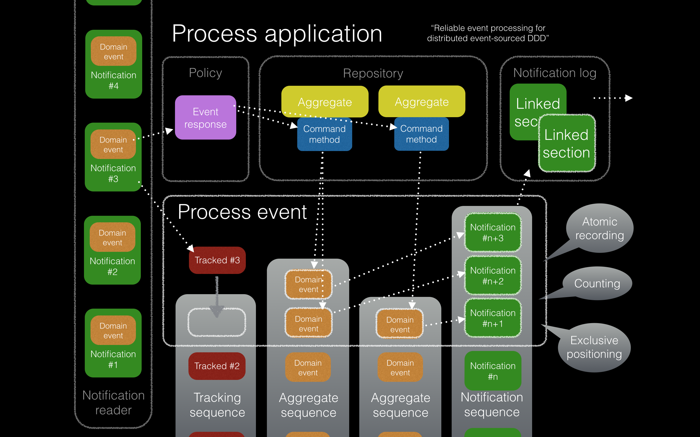

===================
Distributed systems
===================

This section discusses how to make a reliable distributed system
that is scalable and maintainable.

.. (If we can reject the pervasive description of `distributed systems
.. <https://en.wikipedia.org/wiki/Distributed_computing>`__ as a system of
.. passing messages, where `message passing means sending messages
.. <https://en.wikipedia.org/wiki/Message_passing>`__, then we do not need
.. to be concerned with the number of times a message is delivered, and can
.. avoid failing to find a good solution to the false problem of guaranteeing
.. once-only delivery of messages, which in itself doesn't determine the
.. processing as reliable. Hence we do not need to protect against "at least
.. once" delivery. We can avoid the restriction of making aggregate commands
.. idempotent. We can also avoid storing all the received messages in order to
.. de-duplicate and reorder.)

.. To limit this discussion even further, any programming errors in the policies or
.. aggregates of a process that may inadvertently define pathological behaviour are
.. considered to be a separate concern.

.. contents:: :local:

Overview
========

A design for distributed systems is introduced that uses event-sourced
applications as building blocks. The earlier design of the
:doc:`event-sourced application </topics/application>` is extended in
the design of the "process application". Process application classes
can be composed into a set of pipeline expressions that together define
a system pipeline. This definition of a system can be entirely independent
of infrastructure. Such a system can be run in different ways with identical
results.

Rather than seeking reliability in mathematics (e.g.
`CSP <https://en.wikipedia.org/wiki/Communicating_sequential_processes>`__)
or in physics (e.g. `Actor model <https://en.wikipedia.org/wiki/Actor_model>`__),
the approach taken here is to seek reliable foundations in engineering empiricism,
specifically in the empirical reliability of `counting <https://en.wikipedia.org/wiki/Counting>`__
and of `ACID database transactions <https://en.wikipedia.org/wiki/ACID_(computer_science)>`__.

Just as event sourcing "atomised" application state as a set of domain
events, similarly the processing of domain events can be atomised as a
potentially distributed set of local "process events" in which new domain
events may occur. The subjective aim of a process event is "catching up
on what happened".

The processing of domain events is designed to be atomic and successive
so that processing can progress in a determinate manner according to
infrastructure availability. A provisional description of a design
pattern for process events is included at the end of this section.

Process application
===================

A process application is an event-sourced :doc:`projection </topics/projections>`
into an event-sourced :doc:`application </topics/application>`. One
process application may "follow" another. A process application
projects the state of the applications it follows into its own state.
Being an event sourced application, the state of a process application
can be obtained using a :doc:`notification log reader  </topics/notifications>`
to obtain the state as a sequence of domain events. The projection itself
is defined by the application's policy, which defines responses to domain
events in terms of domain model operations, causing new domain events to
be generated.

The library has a process application class
:class:`~eventsourcing.application.process.ProcessApplication`, it
functions as a projection into an event-sourced application.
It extends :class:`~eventsourcing.application.simple.SimpleApplication`
by having a notification log reader for each application it follows. It
has an application policy which defines how to respond to the domain events
it reads from the notification logs of the applications it follows. This
process application class implements the process event pattern (notification
tracking and new domain event data are stored together atomically).

Reliability
-----------

Reliability is the most important concern in this section. A process
is considered to be reliable if its result is entirely unaffected
(except in being delayed) by infrastructure failure such as network
partitions or sudden termination of operating system processes.
Infrastructure unreliability may cause processing delays, but disorderly
environments shouldn't (at least by default) cause disorderly processing
results.

The only trick was remembering that production is determined in general
by consumption with recording. In particular, if consumption and
recording are reliable, then production is bound to be reliable.
As shown below, the reliability of this library's approach to event
processing depends only on counting and the atomicity of database
transactions, both of which are normally considered reliable.

Notification tracking
---------------------

A process application consumes domain events by
:doc:`reading event notifications </topics/notifications>`
from its notification log readers. The domain events are retrieved in
a reliable order, without race conditions or duplicates or missing items.
Each event notification in a notification log has a unique integer ID, and
the notification log IDs form a contiguous sequence (counting).

To keep track of its position in the notification log, a process application
will create a unique tracking record for each event notification it processes.
The tracking records determine how far the process has progressed through
the notification log. The tracking records are used to set the position of
the notification log reader when the process application is commenced or resumed.

There can only be one tracking record for each event notification. Once the
tracking record has been written it can't be written again, in which case neither
will any new domain events. Hence, if a domain event notification can be processed
at all, then it will be processed exactly once.

Policies
--------

A process application will respond to domain events according to its policy.
Its policy might do nothing in response to one type of event, and it
might call an aggregate command method in response to another type of
event. If the aggregate method generates new domain events, they will
be available in its notification log for others to read, just like a
normal event-sourced application.

Whatever the policy response, the process application will write one
tracking record for each event notification, along with new stored event
and notification records, in an atomic database transaction.

Atomicity
---------

Just like a ratchet is as strong as its teeth and pawl, a process
application is as reliable as the atomicity of its database transactions.
If some of the new records from processing a domain event can't be written,
then none will be committed. If anything goes wrong before all the records are
written, the transaction will abort, and none of the records will be committed.
On the other hand, if a some records are committed, then all will be committed,
and the process will complete an atomic progression.

The atomicity of the recording and consumption determines the production as atomic:
a continuous stream of events is processed in discrete, sequenced, indivisible units.
Hence, interruptions can only cause delays.

Whilst the heart of this design is having the event processing proceed atomically
so that any completed "process events" are exactly what they should be, of course
the "CID" parts of ACID database transactions are also crucial. Especially, it is
assumed that any records that have been committed will be available after any
so-called "infrastructure failure". The continuing existence of data that has been
successfully committed to a database is beyond the scope of this discussion about
reliability. However, the "single point of failure" this may represent is acknowledged.

System of processes
===================

The library class :class:`~eventsourcing.system.definition.System`
can be used to define a system of process applications,
entirely independently of infrastructure.
In a system, one process application can follow another. One process can
follow two other processes in a slightly more complicated system. A system
could be just one process application following itself.

The reliability of the domain event processing allows a reliable "saga" or
a "process manager" to be written without restricting or cluttering the application
logic with precaution and remediation for infrastructure failures.

Infrastructure-independence
---------------------------

A system of process applications can be defined independently of infrastructure so that the
same system can be run with different infrastructure at different times.
For example, a system of process applications could be developed for use with
SQLAlchemy, and later reused in a Django project.

System runners
--------------

A system of process applications can run in a single thread,
with synchronous propagation and processing of events through
the system pipeline. A system can also be run with multiple
threads or multiple operating system processes, with application
state propagated asynchronously in various ways.

An asynchronous pipeline with multi-threading or multi-processing
means one event can be processed by each process application at
the same time. This is very much like
`instruction pipelining <https://en.wikipedia.org/wiki/Instruction_pipelining>`__
in a CPU core.

Maintainability
---------------

Whilst maintainability is greatly assisted by having an entire
system of applications defined independently of infrastructure, it
also greatly helps to run such a system synchronously with a single
thread. So long as the behaviours are preserved, running the system
without any concurrent threads or processes makes it much easier to
develop and maintain the system.

Scalability
-----------

Especially when using multiple operating system processes, throughput
can be increased by breaking longer steps into smaller steps, up but
only to a limit provided by the number of steps actually required by
the domain. Such "diachronic" parallelism therefore provides limited
opportunities for scaling throughput.

A system of process applications can also be run with many parallel
instances of the system pipeline. This is very much like the way a
multi-core CPU has many cores (a core is a pipeline). This "synchronic"
parallelism means that many domain events can be processed by the same
process application at the same time. This kind of parallelism allows
the system to be scaled, but only to a limit provided by the degree of
parallelism inherent in the domain (greatest when there are no causal
dependencies between domain events, least when there are maximal causal
dependencies between domain events).

Causal dependencies
-------------------

Causal dependencies are needed to synchronise between parallel processing of a
sequence of events. This is used in the library when a system is run with multiple
pipelines.

Causal dependencies between events can be automatically detected and used to synchronise
the processing of parallel pipelines downstream. For example, if an aggregate is created
and then updated, the second event is obviously causally dependent on the first (you can't
update something that doesn't exist). Downstream processing in one pipeline can wait (stall)
for a dependency to be processed in another pipeline. This is like a pipeline interlock in
a multi-core CPU.

In the process applications, the causal dependencies are automatically inferred by detecting
the originator ID and version of aggregates as they are retrieved from the repository. The
old notifications are referenced in the first new notification. Downstream can then check
all causal dependencies have been processed, using its tracking records.

In case there are many dependencies in the same pipeline, only the newest dependency in each
pipeline is included. By default in the library, only dependencies in different pipelines are
included. If causal dependencies from all pipelines were included in each notification, each
pipeline could be processed in parallel, to an extent limited by the dependencies between the
notifications.

.. If persistence were optional, this design could be used for high-performance applications
.. which would be understood to be less durable. Data could be streamed out asynchronously
.. and still stored atomically but after the processing notifications are available.
.. Resuming could then go back several steps, and perhaps a signal could be sent so
.. downstream restarts from an earlier step. Or maybe the new repeat processing could
.. be ignored by downstream, having already processed those items.

Kahn process networks
---------------------

Because a notification log and reader functions effectively as a FIFO, a system of
determinate process applications can be recognised as a `Kahn Process Network
<https://en.wikipedia.org/wiki/Kahn_process_networks>`__ (KPN).

Kahn Process Networks are determinate systems. If a system of process applications
happens to involve processes that are not determinate, or if the processes split and
combine or feedback in a random way so that nondeterminacy is introduced by design,
the system as a whole will not be determinate, and could be described in more general
terms as "dataflow" or "stream processing".

Whether or not a system of process applications is determinate, the processing will
be reliable (results unaffected by infrastructure failures).

High performance or "real time" processing could be obtained by avoiding writing to a
durable database and instead running applications with an in-memory database.

Process managers
----------------

A process application, specifically an aggregate combined with a policy in a process application,
could function effectively as a "saga", or "process manager", or "workflow manager". That is, it
could effectively cause a sequence of steps involving other aggregates in other applications,
steps that might otherwise be controlled with a "long-lived transaction". It could 'maintain
the state of the sequence and determine the next processing step based on intermediate results',
to quote a phrase from Enterprise Integration Patterns. These terms ("saga", "process manager",
etc.) can be used here as names for things we already have, but they add nothing in particular,
since any reliable behaviour can be coded with combinations of events sourced aggregates and
application policies. Exceptional "unhappy path" behaviour can be implemented as part of the
logic of the application.

Example
=======

The example below is suggestive of an orders-reservations-payments system.
The system automatically processes a new Order by making a Reservation, and
then a Payment; facts registered with the Order as they happen.

The behaviour of the system is entirely defined by the combination of the
aggregates and the policies of its process applications. This allows highly
maintainable code that is easily tested, easily understood, easily
changed, and easily reconfigured for use with different infrastructure.

The system is run: firstly as a single threaded system; then with
multiprocessing using a single pipeline; then multiprocessing with multiple
pipelines; and finally multiple pipelines with the actor model.

Please note, this example system is designed to exhibit a range of capabilities
of the library and is not necessarily an example of good system design. In particular,
whilst having "branches" (where one application is followed by more than one other
application) does not introduce indeterminacy in the final system state, having "joins"
(where one application follows more than one other) does so. Perhaps a better
generic template for most domains is more simply to have a commands process followed
by a core application for the domain, that is followed by a reporting application
(``Commands | Core | Reporting``).

Please also note, the code presented in the example below works with the library's
SQLAlchemy infrastructure code, and it can work with the library's Django infrastructure
code. Support for Cassandra is being considered but such applications will probably be
simple replications of application state, due to the limited atomicity of Cassandra's
lightweight transactions. For example, Cassandra could be used to archive events written
firstly into a relational database. Events could be removed from the relational database
before storage limits are encountered. Events missing in the relational database could be
sourced from Cassandra.

Aggregates
----------

In the domain model below, event-sourced aggregates are defined for
orders, reservations, and payments.

An ``Order`` can be created. An existing order can be set as reserved,
which involves a reservation ID. Having been created and reserved,
an order can be set as paid, which involves a payment ID.

.. code:: python

    from eventsourcing.domain.model.aggregate import AggregateRoot

    class Order(AggregateRoot):

        class Event(AggregateRoot.Event):
            pass

        @classmethod
        def create(cls, command_id):
            return cls.__create__(command_id=command_id)

        class Created(Event, AggregateRoot.Created):
            pass

        def __init__(self, command_id=None, **kwargs):
            super(Order, self).__init__(**kwargs)
            self.command_id = command_id
            self.reservation_id = None
            self.payment_id = None

        @property
        def is_reserved(self):
            return self.reservation_id is not None

        def set_is_reserved(self, reservation_id):
            assert not self.is_reserved, "Order {} already reserved.".format(self.id)
            self.__trigger_event__(
                Order.Reserved, reservation_id=reservation_id
            )

        class Reserved(Event):
            def mutate(self, order: "Order"):
                order.reservation_id = self.reservation_id

        @property
        def is_paid(self):
            return self.payment_id is not None

        def set_is_paid(self, payment_id):
            assert not self.is_paid, "Order {} already paid.".format(self.id)
            self.__trigger_event__(
                self.Paid, payment_id=payment_id, command_id=self.command_id
            )

        class Paid(Event):
            def mutate(self, order: "Order"):
                order.payment_id = self.payment_id

A ``Reservation`` can be created. A reservation has an ``order_id``.

.. code:: python

    class Reservation(AggregateRoot):

        class Event(AggregateRoot.Event):
            pass

        @classmethod
        def create(cls, order_id):
            return cls.__create__(order_id=order_id)

        class Created(Event, AggregateRoot.Created):
            pass

        def __init__(self, order_id, **kwargs):
            super(Reservation, self).__init__(**kwargs)
            self.order_id = order_id

Similarly, a ``Payment`` can be created. A payment also has an ``order_id``.

.. code:: python

    class Payment(AggregateRoot):

        class Event(AggregateRoot.Event):
            pass

        @classmethod
        def create(cls, order_id):
            return cls.__create__(order_id=order_id)

        class Created(Event, AggregateRoot.Created):
            pass

        def __init__(self, order_id, **kwargs):
            super(Payment, self).__init__(**kwargs)
            self.order_id = order_id

All the domain event classes are defined explicitly on the aggregate root
classes. This is important because the application policies will use the
domain event classes to decide how to respond to the events, and if the
aggregate classes use the event classes from the base aggregate root class,
then one aggregate's ``Created`` event can't be distinguished from another's,
and the application policy won't work as expected.

The behaviours of this domain model can be fully tested with simple test
cases, without involving any other components.

Commands
--------

Commands have been discussed previously as
:doc:`methods on domain entities </topics/domainmodel>`. Here, system
commands are introduced, as event sourced aggregates created within a
separate "commands application".

One advantage of having distinct command aggregates is that old commands
can be used to check the same application state is generated by a new
version of the system.

Another advantage of using a separate commands application is that commands
can be introduced into an event processing system without interrupting the
event processing of the core process applications. (Treating a process
application as a normal application certainly works, but can potentially
cause contention writing to the notification log.)

Responses can be collected by creating separate "command response" aggregates
in a separate "responses" process application. An alternative approach involves
updating the command aggregate, and having the commands application follow a core
process application.

In the example below, the command class ``CreateOrder`` is defined using the
library's command class, :class:`~eventsourcing.domain.model.command.Command`, which
extends the library's :class:`~eventsourcing.domain.model.aggregate.AggregateRoot`
class with a method ``done()`` and a property ``is_done``.

The ``CreateOrder`` class extends the library's
:class:`~eventsourcing.domain.model.command.Command`.
A ``CreateOrder`` command can be assigned an order ID.
Its ``order_id`` is initially ``None``.

.. code:: python

    from eventsourcing.domain.model.command import Command
    from eventsourcing.domain.model.decorators import attribute

    class CreateOrder(Command):

        class Event(Command.Event):
            pass

        @classmethod
        def create(cls):
            return cls.__create__()

        class Created(Event, Command.Created):
            pass

        @attribute
        def order_id(self):
            pass

        class AttributeChanged(Event, Command.AttributeChanged):
            pass

The ``order_id`` will eventually be used to keep the ID of
an ``Order`` aggregate created by the system in response to
a ``CreateOrder`` command being created.

The behaviour of a system command aggregate can be fully tested
with simple test cases, without involving any other components.

.. code:: python

    from uuid import uuid4

    def test_create_order_command():

        # Create a "create order" command.
        cmd = CreateOrder.create()

        # Check the initial values.
        assert cmd.order_id is None
        assert cmd.is_done is False

        # Assign an order ID.
        order_id = uuid4()
        cmd.order_id = order_id
        assert cmd.order_id == order_id

        # Mark the command as "done".
        cmd.done()
        assert cmd.is_done is True

        # Check the events.
        events = cmd.__batch_pending_events__()
        assert len(events) == 3
        assert isinstance(events[0], CreateOrder.Created)
        assert isinstance(events[1], CreateOrder.AttributeChanged)
        assert isinstance(events[2], CreateOrder.Done)

    # Run the test.
    test_create_order_command()

Processes
---------

A process application has a policy which defines how events are processed.
In the code below, process applications are defined for orders, reservations,
payments, and commands.

The ``Orders`` process application policy responds to new commands by
creating a new ``Order`` aggregate. It responds to new reservations by
setting an ``Order`` as reserved. And it responds to a new ``Payment``,
by setting an ``Order`` as paid.

.. code:: python

    from eventsourcing.application.process import ProcessApplication
    from eventsourcing.application.decorators import applicationpolicy

    class Orders(ProcessApplication):

        @applicationpolicy
        def policy(self, repository, event):
            """Do nothing by default."""

        @policy.register(CreateOrder.Created)
        def _(self, repository, event):
            return self._create_order(command_id=event.originator_id)

        @policy.register(Reservation.Created)
        def _(self, repository, event):
            self._set_order_is_reserved(repository, event)

        @policy.register(Payment.Created)
        def _(self, repository, event):
            self._set_order_is_paid(repository, event)

        @staticmethod
        def _create_order(command_id):
            return Order.create(command_id=command_id)

        def _set_order_is_reserved(self, repository, event):
            order = repository[event.order_id]
            assert not order.is_reserved
            order.set_is_reserved(event.originator_id)

        def _set_order_is_paid(self, repository, event):
            order = repository[event.order_id]
            assert not order.is_paid
            order.set_is_paid(event.originator_id)

The decorator ``@applicationpolicy`` is similar to ``@singledispatch``
from the ``functools`` core Python package. It isn't magic, it's just
a slightly better alternative to an "if-instance-elif-isinstance-..."
block.

The ``Reservations`` process application responds to an ``Order.Created`` event
by creating a new ``Reservation`` aggregate.

.. code:: python

    class Reservations(ProcessApplication):

        @applicationpolicy
        def policy(self, repository, event):
            """Do nothing by default."""

        @policy.register(Order.Created)
        def _(self, repository, event):
            return self._create_reservation(event.originator_id)

        @staticmethod
        def _create_reservation(order_id):
            return Reservation.create(order_id=order_id)

The payments process application responds to an ``Order.Reserved`` event
by creating a new ``Payment``.

.. code:: python

    class Payments(ProcessApplication):

        @applicationpolicy
        def policy(self, repository, event):
            """Do nothing by default."""

        @policy.register(Order.Reserved)
        def _(self, repository, event):
            order_id = event.originator_id
            return self._create_payment(order_id)

        @staticmethod
        def _create_payment(order_id):
            return Payment.create(order_id=order_id)

A separate "commands application" is defined below. It extends the library class
:class:`~eventsourcing.application.command.CommandProcess`.

It has a factory method
``create_order()`` which can be used to
create and save new ``Order`` aggregates.

The library class
:class:`~eventsourcing.application.command.CommandProcess`
extends
:class:`~eventsourcing.application.process.ProcessApplication`
and so is also a
:class:`~eventsourcing.application.simple.SimpleApplication`. It
and has its ``persist_event_type`` set to the
:class:`~eventsourcing.domain.model.command.Command.Event` supertype
for domain events of :class:`~eventsourcing.domain.model.command.Command`
aggregates, so that by default the domain events of a command aggregate
will be persisted when a command aggregate is "saved".

The ``Commands`` class below also defines a policy that responds both to
``Order.Created`` events by setting the ``order_id`` on the command, and to
``Order.Paid`` events by setting the command as done.

.. code:: python

    from eventsourcing.application.command import CommandProcess
    from eventsourcing.domain.model.decorators import retry
    from eventsourcing.exceptions import OperationalError, RecordConflictError

    class Commands(CommandProcess):
        @staticmethod
        @retry((OperationalError, RecordConflictError), max_attempts=10, wait=0.01)
        def create_order():
            cmd = CreateOrder.create()
            cmd.__save__()
            return cmd.id

        @applicationpolicy
        def policy(self, repository, event):
            """Do nothing by default."""

        @policy.register(Order.Created)
        def _(self, repository, event):
            cmd = repository[event.command_id]
            cmd.order_id = event.originator_id

        @policy.register(Order.Paid)
        def _(self, repository, event):
            cmd = repository[event.command_id]
            cmd.done()

The ``@retry`` decorator overcomes contention when creating new commands
whilst also processing domain events from the ``Orders`` application.

Please note, the ``__save__()`` method of aggregates must not be called in a process policy,
because pending events from both new and changed aggregates will be automatically collected by
the process application after its ``policy()`` method has returned. To be reliable, a process
application needs to commit all the event records atomically with a tracking record, and calling
``__save__()`` will instead commit events in a separate transaction. Policies must return new
aggregates to the caller, but do not need to return existing aggregates that have been accessed
or changed.

.. Tests
.. ~~~~~

Process policies are just functions, and are easy to test.

In the orders policy test below, an existing order is marked as reserved because
a reservation was created. The only complication comes from needing to prepare
at least a fake repository and a domain event, given as required arguments when
calling the policy in the test. If the policy response depends on already existing
aggregates, they will need to be added to the fake repository. A Python dict can
function effectively as a fake repository in such tests. It seems simplest to
directly use the model domain event classes and aggregate classes in these tests,
rather than coding `test doubles <https://martinfowler.com/bliki/TestDouble.html>`__.

.. Since the ``Orders`` application class was defined independently of
.. infrastructure, it needs to be mixed with a concrete application
.. infrastructure class before it can be constructed. The concrete
.. application infrastructure class used in this test is
.. :class:`~eventsourcing.application.popo.PopoApplication`
.. which uses Plain Old Python Objects to store domain events,
.. and is the fastest application infrastructure class in the
.. library. It can be used when proper disk-based durability
.. is not required, for example when testing. The class method
.. ``bind()`` simply calls ``mixin()`` to construct a new object
.. class which has ``Orders`` and ``PopoApplication`` as bases.
.. This new subclass is immediately constructed into a process
.. application object. Using a process application object as a
.. context manager ensures it is finally closed.

.. code:: python

    def test_orders_policy():

        # Prepare repository with a real Order aggregate.
        order = Order.create(command_id=None)
        repository = {order.id: order}

        # Check order is not reserved.
        assert not order.is_reserved

        # Check order is reserved whenever a reservation is created.
        event = Reservation.Created(originator_id=uuid4(), originator_topic='', order_id=order.id)
        Orders().policy(repository, event)
        assert order.is_reserved

    # Run the test.
    test_orders_policy()

In the payments policy test below, a new payment is created
because an order was reserved.

.. code:: python

    def test_payments_policy():

        # Prepare repository with a real Order aggregate.
        order = Order.create(command_id=None)
        repository = {order.id: order}

        # Check payment is created whenever order is reserved.
        event = Order.Reserved(originator_id=order.id, originator_version=1)
        payment = Payments().policy(repository, event)
        assert isinstance(payment, Payment), payment
        assert payment.order_id == order.id

    # Run the test.
    test_payments_policy()

It isn't necessary to return changed aggregates from the policy. The test
will already have a reference to the aggregate, since it will have constructed
the aggregate before passing it to the policy in the fake repository, so the test
will already be in a good position to check that already existing aggregates are
changed by the policy as expected. The test gives a ``repository`` to the policy,
which contains the ``order`` aggregate expected by the policy.

.. To explain a little bit, in normal use, when new events are retrieved
.. from an upstream notification log, the ``policy()`` method is called by the
.. ``call_policy()`` method of the ``Process`` class. The ``call_policy()`` method wraps
.. the process application's aggregate repository with a wrapper that detects which
.. aggregates are used by the policy, and calls the ``policy()`` method with the events
.. and the wrapped repository. New aggregates returned by the policy are appended
.. to this list. New events are collected from this list of aggregates by getting
.. any (and all) pending events. The records are then committed atomically with the
.. tracking record. Calling ``__save__()`` will avoid the new events being included
.. in this mechanism and will spoil the reliability of the process. As a rule, don't
.. ever call the ``__save__()`` method of new or changed aggregates in a process
.. application policy. And always use the given ``repository`` to retrieve aggregates,
.. rather than the original process application's repository (``self.repository``)
.. which doesn't detect which aggregates were used when your policy was called.

Apply policy to generated events
~~~~~~~~~~~~~~~~~~~~~~~~~~~~~~~~

It is possible to set the ``apply_policy_to_generated_events`` class attribute
of ``ProcessApplication`` to a ``True`` value. In this case, the policy will
be applied to events that are generated by the policy, and all of them will
be saved within the same atomic "process event". This can avoid having a
process application follow itself in a system.

.. code:: python

    class ReflexiveApplication(ProcessApplication):
        apply_policy_to_generated_events = True

This will have no effect unless the policy is written to respond to the types
of domain events that generated by parts of the policy that respond to the types
of domain events generated by the applications that this process application
is following.

System
------

A system of process applications can be defined using the library
:class:`~eventsourcing.system.definition.System` object class, with
one or many "pipeline expressions", each involving process application classes
"linked" in a "pipeline" with Python's bitwise OR operator ``|``.

For example, the pipeline expression ``A | A`` would have process application class
``A`` following itself. The expression ``A | B | C`` would have ``A`` followed by
``B`` and ``B`` followed by ``C``. This can perhaps be recognised as the "pipes and
filters" pattern, where the process applications function effectively as the filters.
(The library's process application class uses a metaclass to support this, and although
I'm normally averse to "extending the language", this seems to add
a certain distinctiveness to the expression of a system.).

In the system defined below, the ``Orders`` process follows the ``Commands`` process,
and the ``Commands`` process follows the ``Orders`` process, so that each will receive
the events that its policy has been defined to process. Similarly, ``Orders`` and
``Reservations`` follow each other, and also ``Orders`` and ``Payments`` follow each other.

.. code:: python

    from eventsourcing.system.definition import System

    system = System(
        Commands | Orders | Commands,
        Orders | Reservations | Orders,
        Orders | Payments | Orders
    )

This system can alternatively be defined with a single pipeline expression,
which expresses exactly the same set of relationships between the process applications.

.. code:: python

    system = System(
        Commands | Orders | Reservations | Orders | Payments | Orders | Commands
    )

Although a process application class can appear many times in the pipeline
expressions, there will only be one instance of each process when the pipeline
system is instantiated. Each application can follow one or many applications,
and can be followed by one or many applications.

Application state is propagated between process
applications through notification logs only. Each application can
access only the aggregates it has created. For example, an ``Order``
aggregate created by the ``Orders`` process is available in neither
the repository of ``Reservations`` nor the repository of ``Payments``.
If an application could directly use the aggregates of another
application, then processing could produce different results at
different times, and in consequence the processing might not be
reliable. If necessary, a process application can replicate upstream
state within its own state.

Runners
-------

The system above has been defined entirely independently of infrastructure.
Concrete application infrastructure is introduced by the system runners. A
concrete application infrastructure class can be specified when constructing
a system runner with a suitable value of ``infrastructure_class``. A system
runner can be used as a context manager.

.. code:: python

    from eventsourcing.application.popo import PopoApplication
    from eventsourcing.system.runner import SingleThreadedRunner

    with SingleThreadedRunner(system, infrastructure_class=PopoApplication):

        # Do stuff here...
        pass

Single threaded runner
~~~~~~~~~~~~~~~~~~~~~~

If the ``system`` object is used with the library class
:class:`~eventsourcing.system.runner.SingleThreadedRunner`, the process
applications will run in a single thread in the current process.

Events will be processed with synchronous handling of prompts,
so that policies effectively call each other recursively, according
to which applications each is followed by.

In the example below, the ``system`` object is used directly as a context
manager. Using the ``system`` object in this manner implicitly constructs
a :class:`~eventsourcing.system.runner.SingleThreadedRunner`, which
uses the infrastructure class
:class:`~eventsourcing.application.popo.PopoApplication` by default. This
infrastructure class uses "plain old Python objects" to store domain events
in memory, implementing atomic transactions and uniqueness constraints like
SQLAlchemy and Django infrastructure classes, and is the fastest concrete
application infrastructure class in the library (much faster than in-memory
SQLite database, for example). This infrastructure can be used when proper
disk-based durability is not required, for example during system development.

.. code:: python

    with system as runner:

        # Create "create order" command.
        commands = runner.get(Commands)
        cmd_id = commands.create_order()

        # Check the command has an order ID and is done.
        cmd = commands.repository[cmd_id]
        assert cmd.order_id
        assert cmd.is_done

        # Check the order is reserved and paid.
        orders = runner.get(Orders)
        order = orders.repository[cmd.order_id]
        assert order.is_reserved
        assert order.is_paid

        # Check the reservation exists.
        reservations = runner.get(Reservations)
        reservation = reservations.repository[order.reservation_id]

        # Check the payment exists.
        payments = runner.get(Payments)
        payment = payments.repository[order.payment_id]

Using the single-threaded runner means that everything happens synchronously
in a single thread, so that by the time ``create_order()`` has returned, the
command has been fully processed by the system.

Running the system with a single thread is useful when developing and testing
a system of process applications, because it runs very quickly and the behaviour
is very easy to follow.

Multi-threaded runner
~~~~~~~~~~~~~~~~~~~~~

Todo: More about the :class:`~eventsourcing.system.runner.MultiThreadedRunner`.

.. Pool of workers
.. ~~~~~~~~~~~~~~~
..
.. An alternative to having a thread dedicated to every process application for each pipeline,
.. the prompts could be sent to via a queue to a pool of workers, which change pipeline and
.. application according to the prompt. Causal dependencies would be needed for all
.. notifications, which is not the library default. The library does not currently
.. support processing events with a pool of workers.

Multiprocess runner
~~~~~~~~~~~~~~~~~~~

The example below shows the same system of process applications running in
different operating system processes, using the library's
:class:`~eventsourcing.system.multiprocess.MultiprocessRunner`
class (which uses Python's ``multiprocessing`` library).

Running the system with multiple operating system processes means the different processes
are running concurrently, so that as the payment is made for one order, another order might
get reserved, whilst a third order is at the same time created.

.. (For those concerned about having too much data in the relational database, it
.. would be possible to expand capacity by: replicating events from the relational
.. database to a more scalable distributed database; changing the event store to
.. read older events from the distributed database if the relational database doesn't
.. have those events, and then removing older events and older snapshots from the
.. relational database. Snapshotting could be configured to avoid getting
.. events from the distributed database for normal operations. The relational database
.. could than have a relatively constant  volume of data. Following the analogy
.. with CPUs, the relational database might correspond to the L2 cache, and the
.. distributed database might correspond to the L3 cache. Please note, this idea
.. isn't currently implemented in the library.)

The code below uses the library's
:class:`~eventsourcing.system.multiprocess.MultiprocessRunner`
class to run the ``system``. It will start one operating system
process for each process application in the system, which in this
example will give a pipeline with four child operating system processes.
This example uses SQLAlchemy to access a MySQL database. The concrete
infrastructure class is :class:`~eventsourcing.application.sqlalchemy.SQLAlchemyApplication`.

.. code:: python

    from eventsourcing.system.multiprocess import MultiprocessRunner
    from eventsourcing.application.sqlalchemy import SQLAlchemyApplication

    runner = MultiprocessRunner(
        system=system,
        infrastructure_class=SQLAlchemyApplication,
        setup_tables=True
    )

The following MySQL database connection string is compatible with SQLAlchemy.

.. code:: python

    import os

    os.environ['DB_URI'] = 'mysql+pymysql://{}:{}@{}/eventsourcing?charset=utf8mb4&binary_prefix=true'.format(
        os.getenv('MYSQL_USER', 'eventsourcing'),
        os.getenv('MYSQL_PASSWORD', 'eventsourcing'),
        os.getenv('MYSQL_HOST', '127.0.0.1'),
    )

.. The process applications could each use their own separate database. If the
.. process applications were using different databases, upstream notification
.. logs would need to be presented in an API, so that downstream could read
.. notifications from a remote notification log, as discussed in the section
.. about notifications (using separate databases is not currently supported
.. by the :class:`~eventsourcing.application.system.MultiprocessRunner` class).

The MySQL database needs to be created before running the next bit of code.

.. code::

    $ mysql -e "CREATE DATABASE eventsourcing;"

Single pipeline
~~~~~~~~~~~~~~~

Since the multi-processing pipeline is asynchronous, let's define a method to check
things are eventually done.

.. code:: python

    @retry((AssertionError, KeyError), max_attempts=60, wait=0.5)
    def assert_eventually_done(repository, cmd_id):
        """Checks the command is eventually done."""
        assert repository[cmd_id].is_done

The multiple operating system processes can be started by using the runner
as a context manager.

.. code:: python

    with runner:

        # Create "create order" command.
        commands = runner.get(Commands)
        cmd_id = commands.create_order()

        # Wait for the processing to complete....
        assert_eventually_done(commands.repository, cmd_id)

        # Check the command has an order ID and is done.
        cmd = commands.repository[cmd_id]
        assert cmd.order_id

        # Check the order is reserved and paid.
        orders = runner.get(Orders)
        order = orders.repository[cmd.order_id]
        assert order.is_reserved
        assert order.is_paid

        # Check the reservation exists.
        reservations = runner.get(Reservations)
        reservation = reservations.repository[order.reservation_id]

        # Check the payment exists.
        payments = runner.get(Payments)
        payment = payments.repository[order.payment_id]

.. Each operating system processes runs a loop that begins by making a call to get prompts
.. pushed from upstream. Prompts are pushed downstream after events are recorded. The prompts
.. are responded to immediately by pulling and processing the new events. If the call to get
.. new prompts times out, then any new events in upstream notification logs are pulled anyway,
.. so that the notification log is effectively polled at a regular interval. The upstream log
.. is also pulled when the process starts. Hence if upstream suffers a sudden termination just
.. before the prompt is pushed, or downstream suffers a sudden termination just after receiving
.. the prompt, the processing will continue promptly and correctly after the process is restarted,
.. even though the prompt was lost. Please note, prompts merely reduce latency of polling, and
.. the system could function without them (just with more latency).

.. Because the orders are created with a second instance of the ``Orders`` process
.. application, rather than e.g. a command process application that is followed
.. by the orders process, there will be contention and conflicts writing to the
.. orders process notification log. The example was designed to cause this contention,
.. and the ``@retry`` decorator was applied to the ``create_order()`` factory, so
.. when conflicts are encountered, the operation will be retried and will most probably
.. eventually succeed. For the same reason, the same ``@retry``  decorator is applied
.. the ``run()`` method of the library class ``Process``. Contention is managed successfully
.. with this approach.
..
.. Todo: Change this to use a command logging process application, and have the Orders process follow it.

Multiple pipelines
~~~~~~~~~~~~~~~~~~

The system can run with many instances of its pipeline. By having more
than one instance of the system pipeline, more than one instance of each
process application can be instantiated (one for each pipeline). Pipelines
are distinguished by integer ID. The ``pipeline_ids`` are given to the
:class:`~eventsourcing.system.multiprocess.MultiprocessRunner`
class when the runner is constructed.

In this example, there are three pipeline IDs, so there will be three
instances of the system pipeline, giving twelve child operating system
processes altogether.

.. code:: python

    runner = MultiprocessRunner(
        system=system,
        infrastructure_class=SQLAlchemyApplication,
        setup_tables=True,
        pipeline_ids = [0, 1, 2]
    )

Fifteen orders will be processed by the system altogether,
five in each pipeline.

.. code:: python

    num_orders = 15

    with runner:

        # Create new orders.
        command_ids = []
        commands = runner.get(Commands)
        while len(command_ids) < num_orders:
            for pipeline_id in runner.pipeline_ids:

                # Change the pipeline for the command.
                commands.change_pipeline(pipeline_id)

                # Create a "create new order" command.
                cmd_id = commands.create_order()
                command_ids.append(cmd_id)

        # Check all commands are eventually done.
        assert len(command_ids)
        for command_id in command_ids:
            assert_eventually_done(commands.repository, command_id)

It would be possible to run the system with e.g. pipelines 0-7 on one machine,
pipelines 8-15 on another machine, and so on. That sort of thing can be
expressed in configuration management, for example with
`Kubernetes <https://kubernetes.io/>`__.

If cluster scaling is automated, it would be useful for processes to be
distributed automatically across the cluster. Actor model seems like one
possible foundation for such automation.

.. There are ways in which the reliability could be relaxed...

Thespian actor model runner
~~~~~~~~~~~~~~~~~~~~~~~~~~~

The `Thespian Actor Library <https://github.com/kquick/Thespian>`__,
can also be used to run a multi-pipeline system of process applications.

The library's :class:`~eventsourcing.system.thespian.ThespianRunner`
is a system runner that uses the Thespian actor model system.

The example below runs with Thespian's "simple system base".

.. code:: python

    from eventsourcing.system.thespian import ThespianRunner

    runner = ThespianRunner(
        system=system,
        infrastructure_class=SQLAlchemyApplication,
        setup_tables=True,
        pipeline_ids=[0, 1, 2]
    )

    with runner:

        # Create new orders.
        command_ids = []
        while len(command_ids) < num_orders:
            commands = runner.get(Commands)
            for pipeline_id in runner.pipeline_ids:

                # Change the pipeline for the command.

                commands.change_pipeline(pipeline_id)

                # Create a "create new order" command.
                cmd_id = commands.create_order()
                command_ids.append(cmd_id)

        # Check all commands are eventually done.
        assert len(command_ids)
        for command_id in command_ids:
            assert_eventually_done(commands.repository, command_id)

With Thespian, a "system base" other than the default "simple system base" can be
started by calling the functions ``start_multiproc_tcp_base_system()`` or
``start_multiproc_queue_base_system()`` before starting the system actors.

The base system can be shutdown by calling ``shutdown_actor_system()``, which
will shutdown any actors that are running in that base system.

With the "multiproc" base systems, the process application system actors will
be started in separate operating system processes. After they have been started,
they will continue to run until they are shutdown. The system actors can be started
by calling ``actors.start()``. The actors can be shutdown with ``actors.shutdown()``.

If ``runner`` is used as a context manager, as above, the ``start()`` method is
called when the context manager enters. The ``close()`` method is called
when the context manager exits. By default the ``shutdown()`` method
is not called by ``close()``. If :class:`~eventsourcing.system.thespian.ThespianRunner`
is constructed with ``shutdown_on_close=True``, which is ``False`` by default, then the
actors will be shutdown when the runner ``close()`` method is called (which happens when
the runner is used as a context manager, and the context manager exits). Even so, shutting
down the system actors will not shutdown a "multiproc" base system. Please refer to the
Thespian documentation for more information.

Ray actor model runner
~~~~~~~~~~~~~~~~~~~~~~

Ray can also be used to run a multi-pipeline system of process applications.

The library's :class:`~eventsourcing.system.ray.RayRunner`
is a system runner that uses
`Ray's actor model system <https://github.com/ray-project/ray>`__,.

.. code:: python

    from eventsourcing.system.ray import RayRunner

    runner = RayRunner(
        system=system,
        infrastructure_class=SQLAlchemyApplication,
        setup_tables=True,
        pipeline_ids=[0, 1, 2]
    )

Please refer to the test for more information about using this class.

Pure gRPC runner
~~~~~~~~~~~~~~~~

Inspired by Ray's use of gRPC, the library offers a pure gRPC runner.

The library's :class:`~eventsourcing.system.grpc.runner.GrpcRunner`
is a system runner that uses `gRPC <https://grpc.io/>`__ to run
a system of process applications.

.. code:: python

    from eventsourcing.system.grpc.runner import GrpcRunner

    runner = GrpcRunner(
        system=system,
        infrastructure_class=SQLAlchemyApplication,
        setup_tables=True,
    )

Please refer to the test for more information about using this class.

..    # Todo: More about using this runner. Code below doesn't run from __main__
..    # Todo: because the command topic seems to get messed up by Ray serialisation.
..    # Todo: However, it might work if the domain model was defined in a different
..    # Todo: module, so perhaps this example could use the PaxosSystem instead?

..    @retry((AssertionError), max_attempts=50, wait=0.1)
..    def assert_ray_eventually_done(runner, pipeline_id, cmd_id):
..        """Checks the command is eventually done."""
..        assert runner.call("commands", pipeline_id, "is_order_done", command_id)
..
..    with runner:
..
..        # Create new orders.
..        command_ids = []
..        while len(command_ids) < num_orders:
..            pipeline_id = len(command_ids) % len(pipeline_ids)
..            command_id = runner.call("commands", pipeline_id, "create_order")
..            command_ids.append(command_id)
..
..        # Check all commands are eventually done.
..        assert len(command_ids)
..        for i, command_id in enumerate(command_ids):
..            break
..            pipeline_id = i % len(pipeline_ids)
..            assert_ray_eventually_done(runner, pipeline_id, command_id)

.. These methods can be used separately. A script can be called to initialise the base
.. system. Another script can start the system actors. Another script can be called to
.. send system commands, so that the system actors actually do some work. Another script
.. can be used to shutdown the system actors. And another can be used to shutdown the
.. base system. That may help operations. Please refer to the
.. `Thespian documentation <http://thespianpy.com/doc>`__ for more information about
.. `dynamic source loading <http://thespianpy.com/doc/in_depth.html>`__.

.. A system actor could start an actor for each pipeline-stage
.. when its address is requested, or otherwise make sure there is
.. one running actor for each process application-pipeline.
..
.. Actor processes could be automatically distributed across a cluster. The
.. cluster could auto-scale according to CPU usage (or perhaps network usage).
.. New nodes could run a container that begins by registering with the actor
.. system, (unless there isn't one, when it begins an election to become leader?)
.. and the actor system could run actors on it, reducing the load on other nodes.
..
.. Prompts from one process application-pipeline could be sent to another
.. as actor messages, rather than with a publish-subscribe service. The address
.. could be requested from the system, and the prompt sent directly.
..
.. To aid development and testing, actors could run without any
.. parallelism, for example with the "simpleSystemBase" actor
.. system in Thespian.
..
.. Scaling the system could be automated with the help of actors. A system actor
.. (started how? leader election? Kubernetes configuration?) could increase or
.. decrease the number of system pipelines, according to the rate at which events
.. are being added to the system command process, compared to the known (or measured)
.. rate at which commands can be processed by the system. If there are too many actors
.. dying from lack of work, then to reduce latency of starting an actor for each event
.. (extreme case), the number of pipelines could be reduced, so that there are enough
.. events to keep actors alive. If there are fewer pipelines than nodes, then some nodes
.. will have nothing to do, and can be easily removed from the cluster. A machine that
.. continues to run an actor could be more forcefully removed by killing the remaining
.. actors and restarting them elsewhere. Maybe heartbeats could be used to detect
.. when an actor has been killed and needs restarting? Maybe it's possible to stop
.. anything new from being started on a machine, so that it can eventually be removed
.. without force.

.. However, it seems that actors aren't a very reliable way of propagating application
.. state. The reason is that actor frameworks will not, in a single atomic transaction,
.. remove an event from its inbox, and also store new domain events, and also write
.. to another actor's inbox. Hence, for any given message that has been received, one
.. or two of those things could happen whilst the other or others do not.
..
.. For example what happens when the actor suddenly terminates after a new domain event
.. has been stored but before the event can be sent as a message? Will the message never be sent?
.. If the actor records which messages have been sent, what if the actor suddenly terminates after
.. the message is sent but before the sending could be recorded? Will there be a duplicate?
..
.. Similarly, if normally a message is removed from an actor's inbox and then new domain
.. event records are made, what happens if the actor suddenly terminates before the new
.. domain event records can be committed?
..
.. If something goes wrong after one thing has happened but before another thing
.. has happened, resuming after a breakdown will cause duplicates or missing items
.. or a jumbled sequence. It is hard to understand how this situation can be made reliable.
..
.. And if a new actor is introduced after the application has been generating events
.. for a while, how does it catch up? If there is a separate way for it to catch up,
.. switching over to receive new events without receiving duplicates or missing events
.. or stopping the system seems like a hard problem.
..
.. In some applications, reliability may not be required, for example with some
.. analytics applications. But if reliability does matter, if accuracy if required,
.. remedies such as resending and deduplication, and waiting and reordering, seem
.. expensive and complicated and slow. Idempotent operations are possible but it
.. is a restrictive approach. Even with no infrastructure breakdowns, sending messages
.. can overrun unbounded buffers, and if the buffers are bounded, then write will block.
.. The overloading can be remedied by implementing back-pressure, for which a standard
.. has been written.
..
.. Even if durable FIFO channels were used to send messages between actors, which would
.. be quite slow relative to normal actor message sending, unless the FIFO channels were
.. written in the same atomic transaction as the stored event records, and removing the
.. received event from the in-box, in other words, the actor framework and the event
.. sourcing framework were intimately related, the process wouldn't be reliable.
..
.. Altogether, this collection of issues and remedies seems exciting at first but mostly
.. inhibits confidence that the actor model offers a simple, reliable, and maintainable
.. approach to propagating the state of an application. It seems like a unreliable
.. approach for projecting the state of an event sourced application, and therefore cannot
.. be the basis of a reliable system that processes domain events by generating other
.. domain events. Most of the remedies each seem much more complicated than the notification
.. log approach implemented in this library.
..
.. It may speed a system to send events as messages, and if events are sent as messages
.. and they happen to be received in the correct order, they can be consumed in that way,
.. which should save reading new events from the database, and will therefore help to
.. avoid the database bottlenecking event propagation, and also races if the downstream
.. process is reading notifications from a lagging database replica. But if new events are generated
.. and stored because older events are being processed, then to be reliable, to underwrite the
.. unreliability of sending messages, the process must firstly produce reliable
.. records, before optionally sending the events as prompts. It is worth noting that sending
.. events as prompts loads the messaging system more heavily that just sending empty prompts,
.. so unless the database is a bottleneck for reading events, then sending events as
.. messages might slow down the system (sending events is slower than sending empty prompts
.. when using multiprocessing and Redis on a laptop).
..
.. The low-latency of sending messages can be obtained by pushing empty prompts. Prompts could
.. be rate limited, to avoid overloading downstream processes, which wouldn't involve any loss
.. in the delivery of events to downstream processes. The high-throughput of sending events as
.. messages directly between actors could help avoid database bandwidth problems. But in case
.. of any disruption to the sequence, high-accuracy in propagating a sequence of events can be
.. obtained, in the final resort if not the first, by pulling events from a notification log.

.. Although propagating application state by sending events as messages with actors doesn't
.. seem to offer a reliable way of projecting the state of an event-sourced application, actors
.. do seem like a great way of orchestrating a system of event-sourced process applications. The "based
.. on physics" thing seems to fit well with infrastructure, which is inherently imperfect.
.. We just don't need by default to instantiate unbounded nondeterminism for every concern
.. in the system. But since actors can fail and be restarted automatically, and since a process
.. application needs to be run by something. it seems that an actor and process process
.. applications-pipelines go well together. The process appliation-actor idea seems like a
.. much better idea that the aggregate-actor idea. Perhaps aggregates could also usefully be actors,
.. but an adapter would need to be coded to process messages as commands, to return pending events as
.. messages, and so on, to represent themselves as message, and so on. It can help to have many
.. threads running consecutively through an aggregate, especially readers. The consistency of the
.. aggregate state is protected with optimistic concurrency control. Wrapping an aggregate as
.. an actor won't speed things up, unless the actor is persistent, which uses resources. Aggregates
.. could be cached inside the process application-pipeline, especially if it is know that they will
.. probably be reused.

.. Todo: Method to fastforward an aggregate, by querying for and applying new events?

Integration with APIs
=====================

Integration with systems that present a server API or otherwise need to
be sent messages (rather than using notification logs), can be integrated by
responding to events with a policy that uses a client to call the API or
send a message. However, if there is a breakdown during the API call, or
before the tracking record is written, then to avoid failing to make the call,
it may happen that the call is made twice. If the call is not idempotent,
and is not otherwise guarded against duplicate calls, there may be consequences
to making the call twice, and so the situation cannot really be described as reliable.

If the server response is asynchronous, any callbacks that the server will make
could be handled by calling commands on aggregates. If callbacks might be retried,
perhaps because the handler crashes after successfully calling a command but before
returning successfully to the caller, unless the callbacks are also tracked (with
exclusive tracking records written atomically with new event and notification records)
the aggregate commands will need to be idempotent, or otherwise guarded against duplicate
callbacks. Such an integration could be implemented as a separate "push-API adapter"
process, and it might be useful to have a generic implementation that can be reused,
with documentation describing how to make such an integration reliable, however the
library doesn't currently have any such adapter process classes or documentation.

.. Todo: Have a simpler example that just uses one process,
.. instantiated without subclasses. Then defined these processes
.. as subclasses, so they can be used in this example, and then
.. reused in the operating system processes.

.. Todo: "Instrument" the tracking records (with a notification log?) so we can
.. measure how far behind downstream is processing events from upstream.

.. Todo: Maybe a "splitting" process that has two applications, two
.. different notification logs that can be consumed separately.

.. Todo: It would be possible for the tracking records of one process to
.. be presented as notification logs, so an upstream process
.. pull information from a downstream process about its progress.
.. This would allow upstream to delete notifications that have
.. been processed downstream, and also perhaps the event records.
.. All tracking records except the last one can be removed. If
.. processing with multiple threads, a slightly longer history of

.. tracking records may help to block slow and stale threads from
.. committing successfully. This hasn't been implemented in the library.

.. Todo: Something about deleting old tracking records automatically.

Process event pattern
=====================

A set of EVENT SOURCED APPLICATIONS can be composed into a system of applications. Application state can be propagated to other applications. Application state is defined by domain event records that have been committed. Each application has a policy which defines how it responds to the domain events it processes.

Infrastructure may fail at any time. Although committed database transactions are expected to be durable, the operating system processes, the network, and the databases may go down at any time. Depending on the system design, application state may be adversely affected by infrastructure failures.

Therefore…

Use counting to sequence the domain events of an application. Use a unique constraint to make sure only one domain event is recorded for each position. Ensure there are no gaps by calculating the next position from the last recorded position. Also use counting to follow the domain events of an upstream application. Use a tracking record to store the current position in the upstream sequence. Use a unique constraint to make sure tracking can be recorded for each upstream domain event only once.

Use atomic database transactions to record process event atomically. Include the tracking position,
the new domain events created by application policy, and their position in the application’s sequence.
Use an object class (or other data type) called "ProcessEvent" to keep these data together, so that
they can be passed into functions as a single argument.

Then, the distributed system can be considered reliable in the sense that the facts in the database will represent either that a process event occurred or that it didn’t occur, and so application state will by entirely unaffected by infrastructure failures.

Event sourced applications may be implemented with EVENT SOURCED AGGREGATES.  To scale the system, use CAUSAL DEPENDENCIES to synchronise parallel pipelines. Use SYSTEM RUNNERS to bind system to infrastructure it needs to run.
